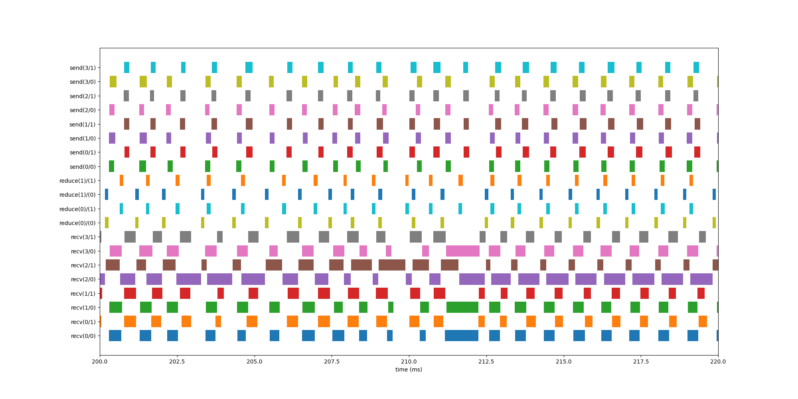
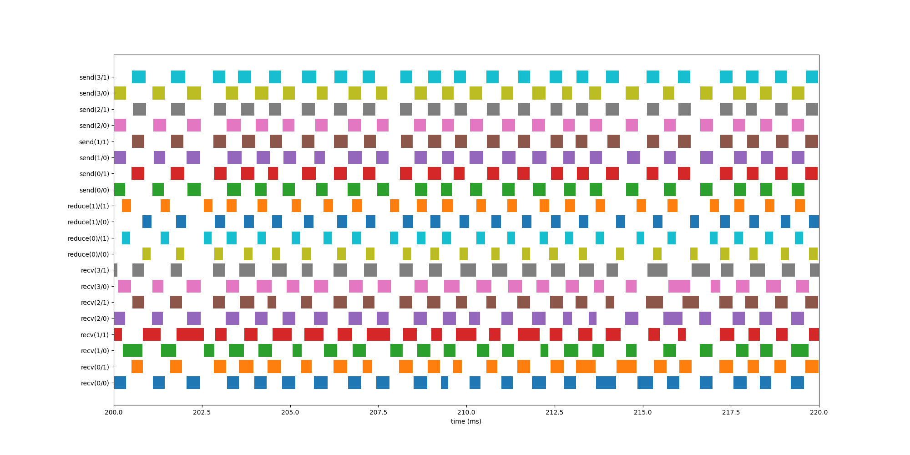

# How to evaluate Optcast

Once Optcast is built, let's move on to evaluation. This section explains how to use `run.py` located under the `test` directory. `run.py` is a Python script designed to easily evaluate Optcast using the official NCCL benchmark tool, [nccl-tests](https://github.com/NVIDIA/nccl-tests).

Currently, Optcast is at the prototype stage and might struggle a bit to achieve the expected performance. `run.py` helps alleviate this struggle by running Optcast with various parameters and visualizing the operation of the reduction server.

This explanation assumes an evaluation environment with two GPU servers and two reduction servers. Each GPU server is equipped with two NVIDIA V100 GPUs and two 100G NICs (ConnectX-6), and each reduction server has two 100G NICs (ConnectX-6) as well.

To maximize performance, [GPUDirect RDMA](https://github.com/Mellanox/nv_peer_memory) is used between the NVIDIA V100 and ConnectX-6.

Please ensure that `mpirun` can be executed on both the GPU servers and the reduction servers beforehand. Additionally, install Python on all servers and prepare an environment where each server can access this repository with the same file path, such as NFS.

This evaluation uses slightly modified versions of NCCL and `nccl-tests`. Both are placed under the `test` directory as Git submodules. Initialize the Git submodules and build/install NCCL and `nccl-tests` as follows:

```bash
$ cd $PATH_TO_REPO/test
$ git submodule init --update
$ make
$ sudo make install
```

Execute `make install` on all servers.

Next, create a configuration file to pass to `run.py`. The format of the configuration file is `YAML`, and it includes information such as the IP addresses of the GPU servers (clients) and the reduction servers (servers).

In an environment like the one we envision, where a single server has multiple GPUs/NICs, launch instances for both clients and servers on each server for the number of GPUs/NICs, assigning one GPU/NIC to each instance. For the client, `nccl-tests` will appropriately allocate the NIC, so you just need to list the hostnames of the servers you want to use (these will be passed to the `mpirun` command). For the server, in addition to `ipaddr` and `port`, use the `env` session to explicitly assign NICs with the environment variable `NCCL_IB_HCA`. Be careful that `port`, which is the Listen port where the server waits for communication from the client, does not overlap on the same server.

In the environment with two GPU servers and two reduction servers that we envision, the configuration would be as follows.

```yaml
# config.yaml
servers:
  - name: server1
    ipaddr: 10.0.0.1
    port: 8080
    env:
      NCCL_IB_HCA: "=mlx5_1:1"
  - name: server1
    ipaddr: 10.0.0.1
    port: 8081
    env:
      NCCL_IB_HCA: "=mlx5_2:1"
  - name: server2
    ipaddr: 10.0.0.2
    port: 8080
    env:
      NCCL_IB_HCA: "=mlx5_1:1"
  - name: server2
    ipaddr: 10.0.0.2
    port: 8081
    env:
      NCCL_IB_HCA: "=mlx5_2:1"
clients:
  - name: client1
  - name: client1
  - name: client2
  - name: client2
```

Once the configuration file is complete, place it in the `test` directory. Then, you are ready to execute `run.py`. Start by taking a look at the help instructions.

```bash
$ python run.py --help
usage: run.py [-h] [--server] [--client] [--size SIZE] [--chunksize CHUNKSIZE] [--num-jobs NUM_JOBS]
              [--num-threads NUM_THREADS] [--num-sends NUM_SENDS] [--num-recvs NUM_RECVS] [--nrank NRANK]
              [--nservers NSERVERS] [--verbose] [--nsplit NSPLIT] [--reduction-servers REDUCTION_SERVERS]
              [--type {optcast,sharp,nccl}] [--nccl-test-options NCCL_TEST_OPTIONS] [--data-type {f32,f16}]
              [--shared-dir SHARED_DIR] [--log-dir LOG_DIR] [--python PYTHON] [--mpirun MPIRUN] [--config CONFIG]
              [--analyze] [--xlim XLIM]

options:
  -h, --help            show this help message and exit
  --server
  --client
  --size SIZE
  --chunksize CHUNKSIZE
  --num-jobs NUM_JOBS
  --num-threads NUM_THREADS
  --num-sends NUM_SENDS
  --num-recvs NUM_RECVS
  --nrank NRANK
  --nservers NSERVERS
  --verbose, -v
  --nsplit NSPLIT
  --reduction-servers REDUCTION_SERVERS
  --type {optcast,sharp,nccl}
  --nccl-test-options NCCL_TEST_OPTIONS
  --data-type {f32,f16}
  --shared-dir SHARED_DIR
  --log-dir LOG_DIR
  --python PYTHON
  --mpirun MPIRUN
  --config CONFIG       config file path. must be located under the shared-dir
  --analyze, -a
  --xlim XLIM, -x XLIM
```

There are several options listed for performance tuning, but let's start by running it with only the `--config` option.

```bash
$ python3 run.py --config ./config.yaml
client: mpirun -np 4 -H client1,client1,client2,client2 -x LD_LIBRARY_PATH python /data/nccl-optcast-plugin/test/run.py --shared-dir /data/nccl-optcast-plugin --client --size 512M --chunksize 512K --nsplit 1 --reduction-servers 10.0.0.1:8080,10.0.0.1:8081,10.0.0.2:8080,10.0.0.2:8081 --nccl-test-options '-c 1 -n 1 -w 1' --type optcast --data-type f32
server: mpirun -bind-to none -np 4 -H server1,server1,server2,server2 python /data/nccl-optcast-plugin/test/run.py --shared-dir /data/nccl-optcast-plugin --server --num-jobs 2 --num-tthreads 2 --num-recvs 4 --num-sends 4 --nrank 4 --chunksize 512K --data-type f32
# nThread 1 nGpus 1 minBytes 536870912 maxBytes 536870912 step: 1048576(bytes) warmup iters: 1 iters: 1 agg iters: 1 validation: 1 graph: 0
#
# Using devices
#  Rank  0 Group  0 Pid 1630648 on    client1 device  0 [0x84] Tesla V100-PCIE-16GB
#  Rank  1 Group  0 Pid 1630654 on    client1 device  1 [0x89] Tesla V100S-PCIE-32GB
#  Rank  2 Group  0 Pid 709778 on    client2 device  0 [0x84] Tesla V100-PCIE-16GB
#  Rank  3 Group  0 Pid 709781 on    client2 device  1 [0x89] Tesla V100S-PCIE-32GB
#
#                                                              out-of-place                       in-place
#       size         count      type   redop    root     time   algbw   busbw #wrong     time   algbw   busbw #wrong
#        (B)    (elements)                               (us)  (GB/s)  (GB/s)            (us)  (GB/s)  (GB/s)
#  536870912     134217728     float     sum      -1   103128    5.21    7.81      0   119592    4.49    6.73      0
# Out of bounds values : 0 OK
# Avg bus bandwidth    : 7.27131
#
client stats:
  e2e  len: 4099, avg: 0.83, sd: 1.22, median: 0.78, min: 0.36, max: 32.97
  req  len: 4099, avg: 0.02, sd: 0.02, median: 0.01, min: 0.00, max: 0.16
  send len: 4099, avg: 0.71, sd: 1.14, median: 0.74, min: 0.05, max: 32.86
  recv len: 4099, avg: 0.11, sd: 0.42, median: 0.00, min: 0.00, max: 16.46

server stats:
  recv len: 4096, avg: 0.42, sd: 1.37, median: 0.30, min: 0.06, max: 32.31
  reduce len: 2048, avg: 0.12, sd: 0.03, median: 0.12, min: 0.09, max: 0.70
  send len: 4096, avg: 0.18, sd: 0.02, median: 0.18, min: 0.10, max: 0.27
```

If you get results like these, regardless of performance, it means that Optcast is running successfully! As for interpreting the results, a simple indicator to start with is the Avg bus bandwidth displayed in the middle. This output is from `nccl-tests` and shows how much bus bandwidth is being utilized when using Ring-AllReduce. Since it's a converted value for when using Ring-AllReduce, it doesn't necessarily mean anything specific when using a reduction server, but it can be used as an indicator.

Here, the Avg bus bandwidth is shown as 7.2GB/s. Next, let's measure the results when using NCCL's Ring-AllReduce without a reduction server. This can be done simply by passing `nccl` to the `--type` option. (The default is set to `optcast`.)

```bash
python3 run.py --nrank 4 --config ./config.yaml --type nccl
client: mpirun -np 4 -H client1,client1,client2,client2 -x LD_LIBRARY_PATH python /data/nccl-optcast-plugin/test/run.py --shared-dir /data/nccl-optcast-plugin --client --size 512M --chunksize 512K --nsplit 1 --reduction-servers 10.0.0.1:8080,10.0.0.1:8081,10.0.0.2:8080,10.0.0.2:8081 --nccl-test-options '-c 1 -n 1 -w 1' --type optcast --data-type f32
# nThread 1 nGpus 1 minBytes 536870912 maxBytes 536870912 step: 1048576(bytes) warmup iters: 1 iters: 1 agg iters: 1 validation: 1 graph: 0
#
# Using devices
#  Rank  0 Group  0 Pid 1631869 on    client1 device  0 [0x84] Tesla V100-PCIE-16GB
#  Rank  1 Group  0 Pid 1631872 on    client1 device  1 [0x89] Tesla V100S-PCIE-32GB
#  Rank  2 Group  0 Pid 710115 on    client2 device  0 [0x84] Tesla V100-PCIE-16GB
#  Rank  3 Group  0 Pid 710112 on    client2 device  1 [0x89] Tesla V100S-PCIE-32GB
#
#                                                              out-of-place                       in-place
#       size         count      type   redop    root     time   algbw   busbw #wrong     time   algbw   busbw #wrong
#        (B)    (elements)                               (us)  (GB/s)  (GB/s)            (us)  (GB/s)  (GB/s)
#  536870912     134217728     float     sum      -1    80965    6.63    9.95      0    77677    6.91   10.37      0
# Out of bounds values : 0 OK
# Avg bus bandwidth    : 10.1569
#
```

The Avg bus bandwidth turned out to be 10.1GB/s, which is a better result than when using the reduction server. To investigate the cause, let's visualize the behavior of the reduction server. Remove the `--type` option (or specify `optcast`) and perform the measurement using the reduction server again.

After execution, you'll notice a `log` directory under the `test` directory. This directory contains logs from both clients and servers, as well as graphs generated from these logs for both clients and servers. Try opening `server.png` for example. The horizontal axis represents time, and the vertical axis represents each thread within the server. You can see the receiving, reducing, and sending threads, but the scale is too large to make out detailed content. To generate a graph with a smaller scale, use the `--analyze` option for log analysis only, and the `--xlim` option to specify the time range for the horizontal axis.

As an example, below is `server.png` generated with `--xlim` set to `200,220`.



Looking at the graph, it's evident that the receiving threads are denser compared to the reducing and sending threads. This indicates that the receiving process is the bottleneck.

NCCL divides the AllReduce instructed by the application into several smaller AllReduces (`chunks`) and executes them. The Optcast NCCL Plugin further divides these small AllReduces and can send requests to multiple reduction servers simultaneously. The number of divisions can be controlled with the environment variable `OPTCAST_SPLIT`, which is set to `1` by default in `run.py`.

Let's try changing this value to 2. Also, when dividing into two stages with NCCL and the Optcast NCCL Plugin, the buffer size becomes smaller, and the overhead of sending and receiving relatively increases. To solve this, let's try increasing the size of the `chunk` that NCCL initially divides from the default 512KB to four times larger, 2MB. The options for `run.py` are `--chunksize` and `--nsplit`. Also, use `--xlim` to generate a graph with a smaller scale from the start.

```bash
$ python3 run.py --nrank 4 --config ./config.yaml --chunksize 2M --nsplit 2 --xlim 200,220
client: mpirun -np 4 -H client1,client1,client2,client2 -x LD_LIBRARY_PATH python3 /data/nccl-optcast-plugin/test/run.py --shared-dir /data/nccl-optcast-plugin --client --size 512M --chunksize 2M --nsplit 2 --reduction-servers 10.0.0.1:8080,10.0.0.1:8081,10.0.0.2:8080,10.0.0.2:8081 --nccl-test-options '-c 1 -n 1 -w 1' --type optcast --data-type f32
server: mpirun -bind-to none -np 4 -H server1,server1,server2,server2 python3 /data/nccl-optcast-plugin/test/run.py --shared-dir /data/nccl-optcast-plugin --server --num-jobs 2 --num-threads 2 --num-recvs 4 --num-sends 4 --nrank 4 --chunksize 2M --nsplit 2 --data-type f32
server stderr: server: /data/nccl-optcast-plugin/reduction_server/target/release/optcast-reduction-server --port 8081 --nrank 4 --reduce-jobs 2 --reduce-threads 2 --recv-threads 4 --send-threads 4 --count 262144 --data-type f32
server stderr: server: /data/nccl-optcast-plugin/reduction_server/target/release/optcast-reduction-server --port 8080 --nrank 4 --reduce-jobs 2 --reduce-threads 2 --recv-threads 4 --send-threads 4 --count 262144 --data-type f32
server stderr: server: /data/nccl-optcast-plugin/reduction_server/target/release/optcast-reduction-server --port 8081 --nrank 4 --reduce-jobs 2 --reduce-threads 2 --recv-threads 4 --send-threads 4 --count 262144 --data-type f32
server stderr: server: /data/nccl-optcast-plugin/reduction_server/target/release/optcast-reduction-server --port 8080 --nrank 4 --reduce-jobs 2 --reduce-threads 2 --recv-threads 4 --send-threads 4 --count 262144 --data-type f32
# nThread 1 nGpus 1 minBytes 536870912 maxBytes 536870912 step: 1048576(bytes) warmup iters: 1 iters: 1 agg iters: 1 validation: 1 graph: 0
#
# Using devices
#  Rank  0 Group  0 Pid 1674285 on    client1 device  0 [0x84] Tesla V100-PCIE-16GB
#  Rank  1 Group  0 Pid 1674290 on    client1 device  1 [0x89] Tesla V100S-PCIE-32GB
#  Rank  2 Group  0 Pid 720817 on    client2 device  0 [0x84] Tesla V100-PCIE-16GB
#  Rank  3 Group  0 Pid 720814 on    client2 device  1 [0x89] Tesla V100S-PCIE-32GB
#
#                                                              out-of-place                       in-place
#       size         count      type   redop    root     time   algbw   busbw #wrong     time   algbw   busbw #wrong
#        (B)    (elements)                               (us)  (GB/s)  (GB/s)            (us)  (GB/s)  (GB/s)
#  536870912     134217728     float     sum      -1    60591    8.86   13.29      0    61371    8.75   13.12      0
# Out of bounds values : 0 OK
# Avg bus bandwidth    : 13.2063
#
client stats:
  e2e  len: 1027, avg: 1.27, sd: 0.20, median: 1.25, min: 0.80, max: 2.11
  req  len: 1027, avg: 0.09, sd: 0.10, median: 0.05, min: 0.01, max: 0.46
  send len: 1027, avg: 1.00, sd: 0.24, median: 0.98, min: 0.22, max: 1.83
  recv len: 1027, avg: 0.18, sd: 0.18, median: 0.13, min: 0.00, max: 0.91

server stats:
  recv len: 2048, avg: 0.51, sd: 1.70, median: 0.36, min: 0.17, max: 32.29
  reduce len: 1024, avg: 0.24, sd: 0.01, median: 0.24, min: 0.20, max: 0.31
  send len: 2048, avg: 0.36, sd: 0.02, median: 0.36, min: 0.22, max: 0.45
```

The Avg bus bandwidth has reached 13.2GB/s, surpassing NCCL! Looking at the graph, the size of the receiving blocks now aligns more closely with the reducing and sending processes, indicating that the bottleneck in the receiving process has been alleviated.


