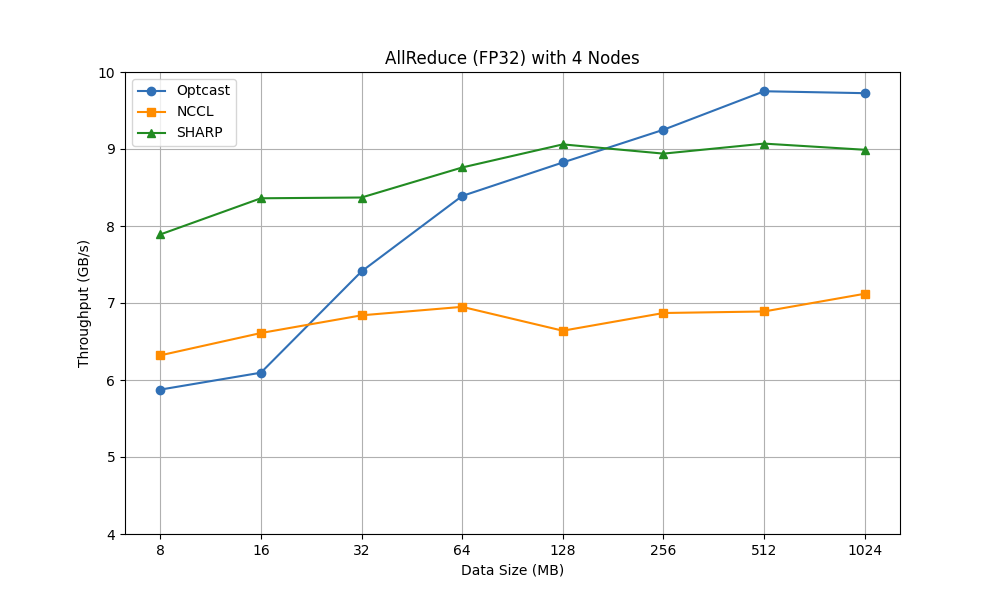

# Evaluation Results

## Environment

The experiments were conducted in the following environment:

- 4 GPU servers
    - CPU: Intel(R) Xeon(R) CPU E5-2660 v4 @ 2.00GHz
    - 2 NVIDIA Tesla V100 GPUs
    - 2 NVIDIA ConnectX-6 network adapters
    - OS: Ubuntu 20.04.6 LTS
    - NCCL: v2.19.4-1 with a patch for adjustable chunk size
    - GPU-Direct RDMA: enabled
- 4 reduction servers
    - CPU: Intel(R) Xeon(R) CPU E5-2660 v4 @ 2.00GHz
    - 2 NVIDIA ConnectX-6 network adapters
    - OS: Ubuntu 20.04.6 LTS
- 1 NVIDIA InfiniBand switch QM8700

See [eval.md](./eval.md) for details on how to reproduce the results.
